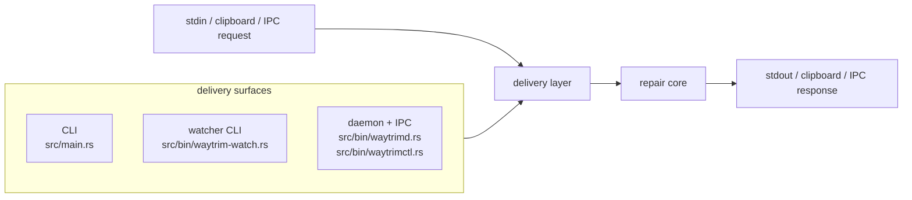
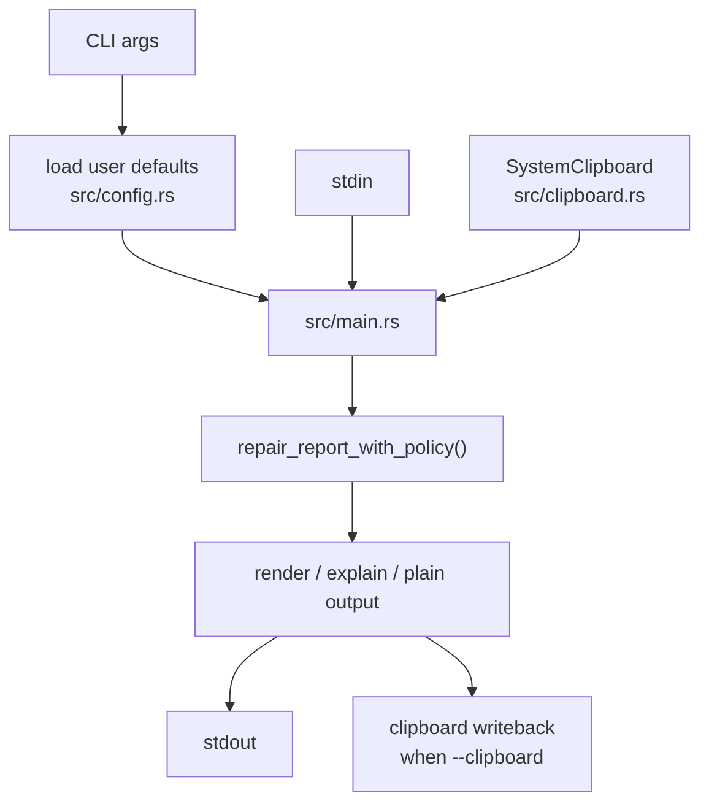
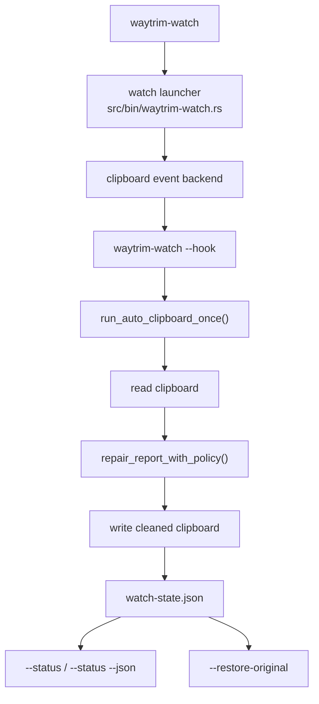
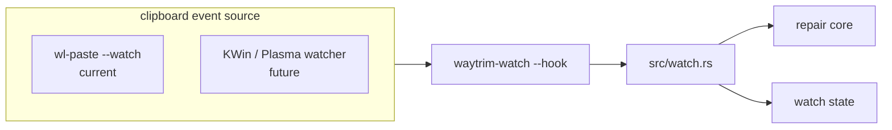

# Architecture

waytrim is structured around a small repair core with thin delivery layers.

## Design goals

- repair, not rewrite
- preserve meaning and visible structure
- keep platform integrations out of the core
- make heuristics easy to test with fixtures
- keep future clipboard, daemon, and UI integrations thin

## Layers

### Core library

`src/core/`

The core library owns:

- repair modes (`prose`, `command`, `auto`)
- conservative cleanup heuristics
- a small `RepairPolicy` / `AutoPolicy` surface for proven boundaries
- preview and explain rendering
- stable text-in / text-out behavior

The core should remain independent from:

- Wayland clipboard APIs
- daemon state and lifecycle
- IPC transport details
- Quickshell / Noctalia UI concerns
- Niri-specific workflow glue

### CLI adapter

`src/main.rs`

The CLI is the current canonical interface. It is intentionally thin:

- parse args
- load user defaults from `src/config.rs`
- merge config defaults with explicit CLI overrides
- read stdin or clipboard text through an adapter
- call the core library
- print repaired text, preview output, or explain output
- write repaired clipboard text back when clipboard mode is active

The preferred clipboard UX is mode-centered: `waytrim prose --clipboard`, not `waytrim clipboard prose`.

Clipboard handling itself stays in a small backend adapter (`src/clipboard.rs`) that shells out to `wl-paste` and `wl-copy`. User config loading lives in `src/config.rs` and resolves to typed defaults before the CLI adapter runs. The CLI flow reuses the same `repair_with_policy()`, `render_preview()`, and `render_explain()` paths as stdin mode, and keeps clipboard status messaging separate from cleaned text output.

### Local service and IPC adapters

`src/service.rs`
`src/ipc.rs`
`src/bin/waytrimd.rs`
`src/bin/waytrimctl.rs`

The local automation layer is also intentionally thin:

- `waytrimd` exposes the same repair core over a Unix socket
- `waytrimctl` sends JSON requests and prints JSON responses or repaired text
- the response contract carries `requested_mode`, `effective_mode`, `decision`, `changed`, `output`, and `explain`
- desktop integrations should target this stable contract instead of internal heuristics

## Mode boundaries

### Prose

Primary mode for repairing wrapped terminal-origin prose, copy-induced spacing noise, and light line-edge padding noise while preserving structure.

### Command

Bounded mode for copied command presentation cleanup. It strips obvious prompts and repairs line continuations without trying to become a shell interpreter. Transcript-shaped snippets stay unchanged by default.

### Auto

Conservative convenience mode. It chooses a clear mode when confidence is high and otherwise falls back to minimal prose-safe cleanup. Prose-framed command examples and install sections stay unchanged by default unless the user explicitly opts into a more prose-friendly policy.

## Testing strategy

Fixtures under `tests/fixtures/` are the main behavioral contract.

The test layout mirrors the product boundary:

- mode-specific integration tests
- positive repair cases
- negative preservation cases
- metadata describing preserve/avoid intent

## Integration direction

These stay outside the core:

- manual clipboard-clean action
- automatic clipboard watcher lifecycle
- Wayland clipboard adapter
- local daemon/service lifecycle
- IPC transport layer
- Quickshell / Noctalia integration
- Niri-oriented keybind workflows

Those layers should call the same core repair contracts rather than introducing separate cleanup logic. The current repo now includes the local service and IPC slice plus watcher-state status snapshots; Quickshell / Noctalia and Niri-specific UX remain delivery-layer work on top of those contracts.

For the manual clipboard slice, `--preview` and `--explain` must remain non-mutating, `--print` must have explicit semantics, and `clipboard unchanged` should be treated as a first-class successful outcome. For always-on clipboard use, the watcher owns one original clipboard backup, exposes status through Rust-managed watcher state, and keeps manual override behavior such as `--clean-once` and `--restore-original` out of QML. Missing user config should be silent, invalid user config should warn and fall back to built-in defaults, and explicit CLI flags should always win over file config.

## Data flow

### Manual CLI flow

### Automatic watcher flow

## Clipboard event boundary

The cleanup logic is already separated from the event source:

- `src/watch.rs` owns one-shot watch behavior, skip-guard logic, restore behavior, and watcher state
- `src/clipboard.rs` owns clipboard read and write operations
- `src/bin/waytrim-watch.rs` currently owns the compositor-specific event hook because it launches `wl-paste --watch`

That means a Plasma-specific watcher backend can stay clean if it only replaces the event source layer and keeps everything after `--hook` unchanged.

This preserves the current architecture:

- no compositor logic in `src/core/`
- no separate cleanup heuristics for Plasma
- no breakage for Niri as long as the existing wlroots path remains available
- one watcher state model and one repair pipeline across both desktops
